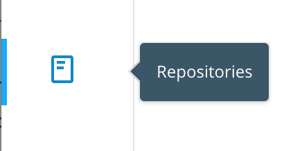
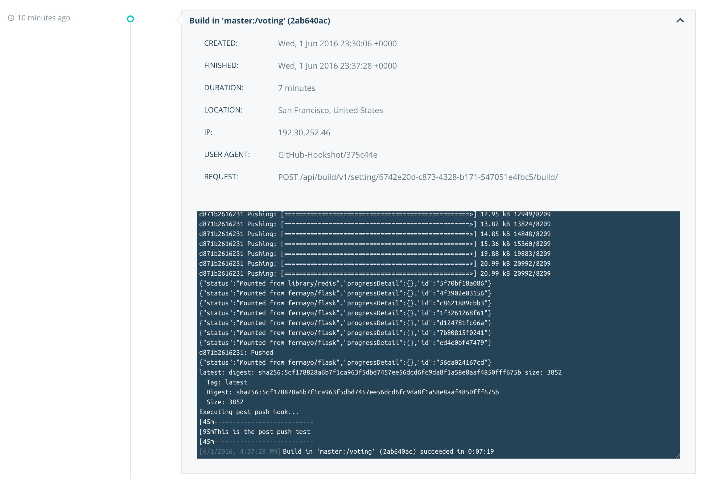

# Continuous Integration With Docker Cloud


> **Difficulty**: Beginner

> **Time**: Approximately 20 minutes

In this lab, you will learn how to configure a continuous integration (CI) pipeline for a web application using Docker Cloud's automated build features. You will complete the following tasks as part of the lab:

> - [Task 0: Configure the prerequisites](#prerequisites)
> - [Task 1: Configure Docker Cloud to Automatically Build Docker Images](#deploy_app)
>  - [Task 1.1: Configure Docker Cloud Autobuilds](#autobuild)
>  - [Task 1.2: Trigger an Autobuild](#test_autobuild)


## What is Docker Cloud?

Docker Cloud is Docker's cloud platform for individual developers and teams to build, ship, and run containerized applications. Docker Cloud enables teams to come together to collaborate on their projects and automate complex continuous delivery flows, which enables you to focus on improving your app, and leave the rest up to Docker Cloud.

## Document conventions

When you encounter a phrase in between `<` and `>`  you are meant to substitute in a different value. 

For instance if you see `ssh <username>@<hostname>` you would actually type something like `ssh ubuntu@node0-gvs0mgc0216.southcentralus.cloudapp.azure.com`

You may be asked to SSH into various nodes. These nodes are referred to as **node0**, **node1** etc. These tags correspond to the very beginning of the hostnames you will find in your welcome email. 

## <a name="prerequisites"></a>Task 0: Prerequisites

In order to complete this lab, you will need the following:

- A Docker ID
- A management host (for this lab you'll need a Linux named **node0**)
- A GitHub account
- Git installed

### Obtain a Docker ID

If you do not already have a Docker ID, you will need to create one now. Creating a Docker ID is free, and allows you to use [Docker Cloud](https://cloud.docker.com).

If you already have a Docker ID, skip to the next prerequisite.

To create a Docker ID:

1. Use your web browser to visit [`https://cloud.docker.com`](https://cloud.docker.com).

2. On the right hand side of the screen, enter your preferred Docker ID, supply your email address, and choose a password.

3. Click `Sign up`.

4. Check your email (**including your spam folder**) for a confirmation email.

5. Follow the steps outlined in the email.

6. You should be redirected back to `https://cloud.docker.com`.

You now have a Docker ID. Remember to keep the password safe and secure. 
		
  
### GitHub account

In order to complete the CI portions of this lab, you will need an account on GitHub. If you do not already have one, you can create one for free at [GitHub](https://github.com).

Continue with the lab as soon as you have completed the prerequisites.


# <a name="deploy_app"></a>Task 1: Configure Docker Cloud to Automatically Build Docker Images

One of the most powerful features of Docker Cloud is the ability to define end-to-end CI/CD pipelines. In this part of the lab, you're going to link your GitHub account to Docker Cloud to facilitate seamless application delivery.

Let's start by linking your Docker Cloud account to your GitHub account:

1. Using your web browser, go to <a href="https://cloud.docker.com">https://cloud.docker.com</a> and sign in with your Docker ID.

2. Click the **Cloud Settings** link in the menu on the left hand side of the Docker Cloud web UI.

> **Note**: If you cannot see menu on the left, un-select **Swarm Mode** at the top of the screen.

3. Scroll down to the **Source providers** section. Click the **power plug** icon next to GitHub, and follow the procedure to link your GitHub account.


Now that you've got Docker Cloud linked to your GitHub account, we'll start by forking a demo repo.

1. In your web browser, navigate to <a href="https://github.com/Cloud-Demo-Team/voting-demo.git"> https://github.com/Cloud-Demo-Team/voting-demo.git</a>.

2. Click the **Fork** button in the upper right hand corner to create your own copy of the source repository.

Next, we'll clone the repository into our local Docker environment. The following commands will be executed in the terminal or command window from Linux **node0**

1. If you have not already, log into your Azure VM. For example:

	```ssh ubuntu@node0-gvs0mgc0216.southcentralus.cloudapp.azure.com```

1. Change to your home directory.

  `$ cd` 

2. Clone the repository (you will need to have `git` installed and the `git` binary present in your PATH).

		$ git clone https://github.com/<your github user name>/voting-demo.git

		Cloning into 'voting-demo'...
		remote: Counting objects: 481, done.
		remote: Total 481 (delta 0), reused 0 (delta 0), pack-reused 481
		Receiving objects: 100% (481/481), 105.01 KiB | 0 bytes/s, done.
		Resolving deltas: 100% (246/246), done.
		Checking connectivity... done.

  This will create a copy of the forked repo in a directory called `voting-demo` within your home directory.

# <a name="autobuild"></a>Task 1.1: Configure Autobuilds

Docker Cloud can automatically build new images when updates are pushed to a repository on GitHub.

In this step, you're going to build two GitHub repositories - one for the **voting** part of the app and one for the **results** part. You'll configure two new repositories in Docker Cloud so that each time a change is pushed to the source repo an updated Docker image will be built.

1. In your web browser, return to Docker Cloud and click the **Repositories** link on the left hand side.

	

2. Click the **+** icon near the top right of the page and select **Repository**.

3. Enter the following information in the **Create Repository** section:

	+ **Name**: results
	+ **Description**: Results service for the Docker voting app
    + **Visibilty**: public

4. In the **Build Settings** section, you should see that your GitHub account is connected. Click the **GitHub icon**. 

5. Make sure the your appropriate GitHub organization is populated from the drop down list, and select **voting-demo** for repository.

6. Select "Click here to customize the build settings" to configure the build rules.

7. Click **Create** at the bottom of the page.

  You will be taken to the repository page.

> Right now Docker Cloud doesn't let you specify the build context when you create a repository, so you need to update the settings

8. Navigate to the Builds page and click 'Configure Automated Builds'. Scroll down to Build Rule, and set the **Build Context** to **/results**:


### Create a second repository
Repeat steps 1-8 with the following modifications:

  Create Repo (Step 3)
  + **Name**: voting
  + **Description**: Voting service for the Docker voting app

Specify the Dockerfile path (in Step 7):
  + Enter **/voting/Dockerfile** for the **Dockerfile Path**

### Check to make sure the repositories were created
If you click the **Repositories** menu on the left you should see both the ```voting``` and ```results``` repositories were created. 

Well done! You've created two new repos and configured them to autobuild whenever new changes are pushed to the associated GitHub repos.

# <a name="test_autobuild"></a>Task 1.2: Trigger an Autobuild

Switch back the command line of your VM. 

1. If you have not already log into your Azure VM. For example (be sure to use the actual node name supplied in your email):

	```ssh ubuntu@node0-gvs0mgc0216.southcentralus.cloudapp.azure.com```

1. Change to the directory containing the voting app. 

		$ cd ~/voting-demo/voting

2. Use vi or your favorite text editor to open `app.py`.
  + To use `vi` on Linux: `$ vi app.py`

3. Scroll down to find the lines containing `optionA` and `optionB`, and change **Dev** and **Ops** to **Futbol** and **Soccer**.

		optionA = "Futbol"
		optionB = "Soccer"

4. Save your changes.

5. Commit changes to the repository and push to GitHub using `git add`, `git commit`, and `git push`.
       
       ```
		$ git add *

		$ git commit -m "changing the voting options"
		
		[master 2ab640a] changing the voting options
 		1 file changed, 3 insertions(+), 2 deletions(-)

 		$ git push origin master
 		
 		Counting objects: 4, done.
		Delta compression using up to 8 threads.
		Compressing objects: 100% (4/4), done.
		Writing objects: 100% (4/4), 380 bytes | 0 bytes/s, done.
		Total 4 (delta 3), reused 0 (delta 0)
		To https://github.com/<your github repo>/voting-demo.git
   		c1788a1..2ab640a  master -> master
       ```
> **Note:** You may be prompted to set your email and name when you attempt to commit your changes. If this is the case, simply follow the instructions provided on your screen.
> 
> **Note:** If you have two factor authentication (2FA) configured on your GitHub account you will need to enter your personal access token (PAT) instead of your password when prompted.

6. In the Docker Cloud web UI, navigate back to the **voting** repo and notice that the status is **BUILDING**.

	> **Note**: It can take several minutes for a build job to complete.

	

7. Click the **Timeline** tab near the top of the screen.

8. Click `Build in master:/voting`.

	Here you can see the status of the build process:

	

Congratulations! You have successfully configured Docker Cloud to automatically build a new Docker image each time you push a change to your application's repository on GitHub.

# <a name="autobuild"></a>Learn More

To learn more about Docker Cloud’s continuous integration (CI) capabilities and how to bring more automation and collaboration to your application pipeline, check out:

- **Video (Automated Builds with Docker Cloud)**: https://www.youtube.com/watch?v=sl2mfyjnkXk
- **Docs**: https://docs.docker.com/docker-cloud/builds/automated-build/
